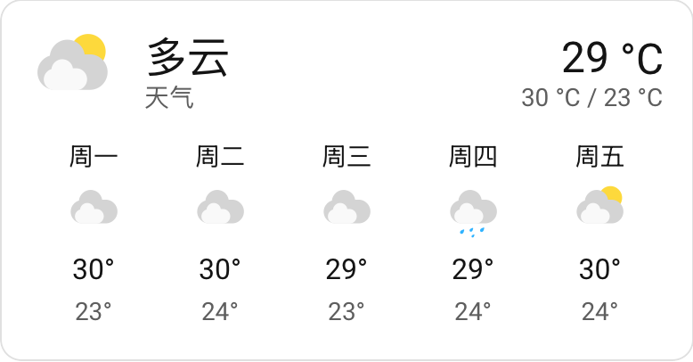
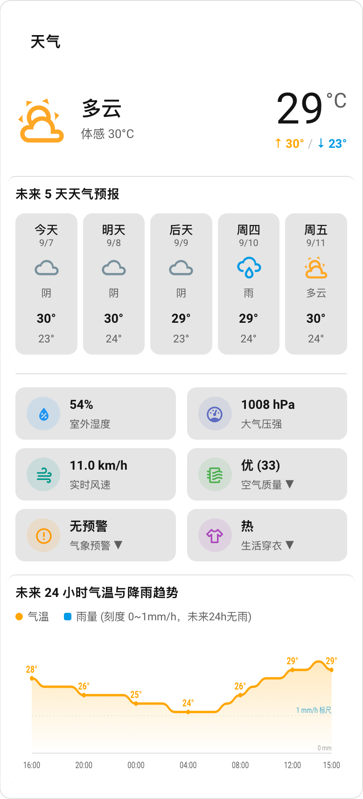
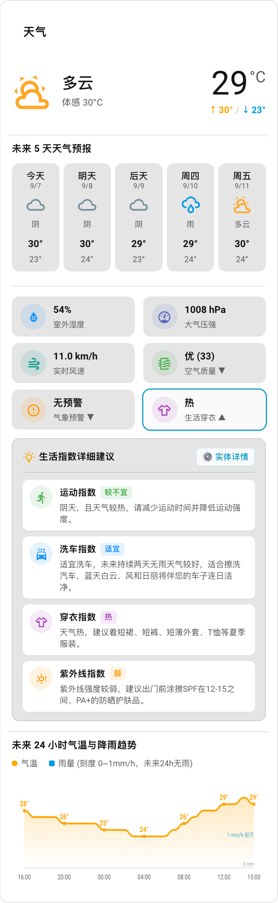

# 和风天气 (QWeather) Home Assistant 现代化原生集成

<p align="center">
  <a href="https://github.com/anooYoona/qweather"></a>
  <a href="https://github.com/hacs/default"></a>
  <a href="https://my.home-assistant.io/redirect/hacs_repository/?owner=anooYoona&repository=qweather&category=integration"></a>
  <a href="https://www.home-assistant.io/"></a>
  <a href="LICENSE"></a>
</p>


专为**和风天气（QWeather）官方开放平台**与 **Home Assistant 现代架构**量身打造的原生集成（Custom Component）。

内置精美、开箱即用的**专属全能气象卡片 (`custom:qweather-card`)**。告别手写冗长复杂的 RESTful YAML，告别繁琐的前端资源导入，在 HA 界面点选即可完成全自动配置！

---

## 核心功能

- **精简与详细双卡片方案**
  - **官方天气预报卡片**：直接支持 Home Assistant 原生天气卡片，界面极简轻量、统一清爽。
  - **专属气象全能卡片 (`custom:qweather-card`)**：免手动配置资源，自带 6 大物理环境指标磁贴（支持点击弹窗，风速磁贴同时显示风速与风向，如 `8.3 km/h 东北`）、24 小时气温降水预测平滑曲线、逐日预报（可在卡片编辑器中选择 3 / 5 / 7 天，默认 5 天）与生活指数折叠抽屉。
- **全链路中英文双语自由切换**
  - 支持 **自动跟随系统 (Auto)**、**中文 (zh)** 与 **English (en)** 三种模式。
  - 实体**显示名称**跟随 Home Assistant 界面语言自动切换（中文环境显示“室外温度”等）；
    实体 ID 始终保持英文（如 `sensor.qweather_temperature`），不会出现拼音。
- **智能差分轮询调度策略（节省 80%+ API 配额）**
  - 和风天气免费账号每日请求有限，本集成采用差分阶梯刷新机制：
    - 气象灾害预警：10 分钟感知一次（突发暴雨雷电及时提醒）
    - 实时天气：20 分钟刷新一次
    - 空气质量：30 分钟刷新一次
    - 逐小时与多天预报：60 分钟刷新一次
  - 在集成“选项”中可按分钟随时自由调节各维度的轮询周期。
- **深度适配和风天气最新 API 架构**
  - 原生支持项目专属域名（例如 `xxx.re.qweatherapi.com`）与公共 API。
  - 适配官方全新 `/airquality/v1/current` 空气质量规范。
  - 支持 **API Key** 与 **JWT (Ed25519)** 两种认证方式：JWT 由集成在本地签发并内存缓存，临近过期前自动续签，不会为每个 HTTP 请求重复签名。
  - 遇到 429 限流时自动读取 `Retry-After` 退避，卡片继续展示上一次成功获取的数据。
- **可自选生活指数**
  - 在配置流程与“选项”中通过多选框自由勾选需要的生活指数（运动、洗车、穿衣、紫外线等 16 种）。
  - 勾选结果直接决定 API 请求的 `type` 参数与卡片抽屉中展示的条目，未勾选的指数不会产生任何请求。
  - 默认勾选：运动、洗车、穿衣、紫外线。
- **严格受限的接口调用范围**
  - 运行期仅调用 6 个接口：`/weather/v1/current`、`/weather/v1/daily`、`/weather/v1/hourly`、
    `/weatheralert/v1/current`、`/v7/indices/{days}`、`/airquality/v1/current`。
  - GeoAPI 城市查询**仅**在初次配置与修改位置时调用一次，解析出的经纬度会持久化到配置项中。
- **丰富细致的气象物理维度**
  - 自动生成完备的气象传感器实体，实时气象现象、温湿度、气压、风速风向、降水量、能见度等关键物理指标一应俱全。

---

## 第一步：准备和风天气 API Key

> 如果您是首次使用和风天气，请按照以下步骤获取 API 密钥：

1. 打开 [和风天气开发者控制台](https://console.qweather.com/) 并注册/登录账号。
2. 在左侧菜单点击 **项目管理** -> 点击右侧 **创建项目**：
   - **项目名称**：自定义（如 `HomeAssistant`）。
   - **凭据名称**：自定义（如 `HomeAssistant`）。
   - **身份认证方式**：选择 **API KEY (普通凭据)**（推荐最简便；高阶用户亦可选用 JWT Token）。
   - 勾选所需要的数据服务（确保勾选包含 **GeoAPI**、**空气质量**、**天气预报**、**天气预警**、**天气指数**）。
3. 创建完成后，进入该项目详情页：
   - 复制生成的 32 位 **API Key**（如 `a1b2c3d4...`）。
4. 在账户设置中复制 **专属 API Host**（如 `xxxxxxxxxx.re.qweatherapi.com`）。

---

## 第二步：安装集成

### 途径 A：通过 HACS 安装（最推荐）

[](https://my.home-assistant.io/redirect/hacs_repository/?owner=anooYoona&repository=qweather&category=integration)

> 点击上方徽章可直接在您的 Home Assistant 中自动弹出添加窗口；若未配置 My Home Assistant，可按下方步骤手动添加：

1. 打开 Home Assistant，点击左侧边栏 **HACS** -> 进入 **集成 (Integrations)**。
2. 点击右上角 **三个点 `...`** -> 选择 **自定义存储库 (Custom repositories)**。
3. 在弹出窗口中填入：
   - **存储库 (Repository)**：`https://github.com/anooYoona/qweather`
   - **类别 (Category)**：选择 **集成 (Integration)**
4. 点击 **添加 (Add)**。
5. 在 HACS 集成列表中搜索 **和风天气 (QWeather)**，点击进入后点击右下角 **下载 (Download)**。
6. 下载完成后，**重启 Home Assistant**。

---

### 途径 B：手动安装

1. 从 [GitHub Releases](https://github.com/anooYoona/qweather/releases) 下载最新的 release 源码包。
2. 将解压出来的 `qweather` 文件夹整体上传到 Home Assistant 的 `custom_components` 目录下，保证目录结构如下：
   ```text
   config/
   └── custom_components/
       └── qweather/
           ├── __init__.py
           ├── manifest.json
           ├── const.py
           ├── api.py
           ├── coordinator.py
           ├── entity.py
           ├── config_flow.py
           ├── sensor.py
           ├── weather.py
           ├── services.yaml
           ├── strings.json
           ├── translations/
           └── frontend/
               └── qweather-card.js
   ```
3. 上传完成后，**重启 Home Assistant**。

---

## 第三步：添加与配置集成

1. 重启后刷新浏览器页面。
2. 前往 **设置** -> **设备与服务** -> 点击右下角 **添加集成**。
3. 搜索 **和风天气** 或 **QWeather**。
4. 首先选择**认证方式**：
   - **API Key**：填写第一步获取的 32 位 Key。
   - **JWT (Ed25519 凭据)**：填写从控制台下载的 **Ed25519 私钥 (PEM)**、**凭据 ID (kid)** 与 **项目 ID (sub)**。
5. 继续填写配置表单：
   - **专属 API Host**：粘贴第一步获取的专属域名（如 `xxx.qweatherapi.com`）。
   - **城市/位置 (Location)**：
     - 支持中文城市名（如 `上海`、`北京`、`深圳`、`海淀`）；
     - 支持经纬度坐标（如 `121.47,31.23`）；
     - **留空即可自动使用 Home Assistant 中设置的家庭地理坐标**。
   - **语言偏好**：选择“自动跟随系统”、“中文”或“English”。
   - **生活指数**：多选需要在卡片抽屉中展示的指数类型（默认：运动、洗车、穿衣、紫外线）。
6. 点击 **提交**，集成将自动验证凭据连通性、解析位置坐标并完成实体创建！

> [!TIP]
> **调整刷新频率**：若日后想要微调数据刷新周期，可在 **“设备与服务” -> “和风天气” -> “选项 (Configure)”** 中按需调整预警、实时、空气、预报的刷新分钟数，也可在此修改位置与生活指数勾选项。

---

## 第四步：添加仪表盘卡片

本集成提供两种卡片展示方案，您可以根据仪表盘风格自由选择：

### 方案一：官方原生天气卡片（极简清爽）
如果您喜欢 Home Assistant 官方统一的极简清爽风格，直接使用系统自带的 **天气预报 (Weather Forecast)** 卡片即可：

<p align="center">
  
</p>

- **UI 可视化添加**：进入仪表盘 -> 点击右上角“编辑仪表盘” -> “添加卡片” -> 选择 **天气预报 (Weather Forecast)**，实体选择 `weather.qweather` 即可。
- **YAML 配置**：
  ```yaml
  type: weather-forecast
  entity: weather.qweather
  show_current: true
  show_forecast: true
  forecast_type: daily  # 可切换为 hourly 展示逐小时预报
  ```

---

### 方案二：和风天气专属全能卡片（丰富详细，自带图表与指数）
如果您希望在卡片中直接查看 **6 大环境物理指标、24 小时气温降水贝塞尔平滑曲线、5 天预报与生活舒适度抽屉**，可添加本集成的专属卡片（集成已全自动挂载资源，无需手动导入 JS 文件）：

<table align="center" style="margin: 0 auto; border: none; background: transparent;">
  <tr style="border: none; background: transparent;">
    <td valign="top" style="border: none; padding: 0 10px; background: transparent; text-align: center;">
      
      <br>
      <sub>专属全能卡片（默认状态）</sub>
    </td>
    <td valign="top" style="border: none; padding: 0 10px; background: transparent; text-align: center;">
      
      <br>
      <sub>点击“生活穿衣”展开指数详情抽屉</sub>
    </td>
  </tr>
</table>

- **UI 可视化添加**：进入仪表盘 -> 点击右上角“编辑仪表盘” -> “添加卡片” -> 搜索选择 **和风天气专属气象卡片**（自带图形化表单，可直接配置标题、实体与语言）。
- **YAML 配置**：
  ```yaml
  type: custom:qweather-card
  entity: weather.qweather  # 可选，默认自动发现
  title: ""                 # 可选，自定义卡片标题，留空则自动显示城市名
  language: auto           # 可选，auto (跟随系统) / zh (中文) / en (English)
  ```

#### 专属卡片参数说明
| 参数名 | 类型 | 必填 | 默认值 | 说明 |
| :--- | :--- | :--- | :--- | :--- |
| `type` | string | **是** | `custom:qweather-card` | 卡片唯一组件标识 |
| `entity` | string | 否 | `weather.qweather` | 绑定的天气实体，默认自动发现 |
| `title` | string | 否 | `空` | 自定义卡片标题，留空则自动显示城市/家庭位置名称 |
| `language` | string | 否 | `auto` | 卡片语言偏好：`auto` (跟随系统)、`zh` (中文)、`en` (English) |


---

## 实体清单与用途参考

| 实体 ID | 平台 | 作用与典型场景 |
| :--- | :--- | :--- |
| `weather.qweather` | Weather | HA 官方标准天气实体，驱动所有原生卡片与逐日/逐小时预报 |
| `sensor.qweather_now` | Sensor | 实时天气核心，包含天气状态现象与各项完整物理属性 |
| `sensor.qweather_air` | Sensor | 空气质量指数（AQI、PM2.5、PM10、优良等级） |
| `sensor.qweather_warning` | Sensor | 气象灾害预警，支持突发暴雨、大风、雷电联动手机推送 |
| `sensor.qweather_indices` | Sensor | 生活舒适度指数（穿衣建议、紫外线强度、洗车指数） |
| `sensor.qweather_temperature` | Sensor | 室外独立温度传感器（支持长期统计曲线与历史报表） |
| `sensor.qweather_humidity` | Sensor | 室外独立湿度传感器（支持长期统计曲线与历史报表） |
| `sensor.qweather_pressure` | Sensor | 大气压强传感器（支持长期统计曲线与历史报表） |
| `sensor.qweather_wind_speed` | Sensor | 实时风速传感器（支持长期统计曲线与历史报表） |
| `sensor.qweather_hourly` | Sensor | 24 小时逐小时预测数据集合 |
| `sensor.qweather_forecast` | Sensor | 多天日夜间预报数据集合 |

---

## 常见问题 (FAQ)

### Q1：空气质量显示“API未开通或无权限 (403)”？
> 和风天气开放平台的免费开发者项目支持空气质量数据，但需要确保您在创建该项目或申请权限时，勾选了包含“空气质量”服务包。请前往和风天气开发者控制台确认该 Key 的权限清单。

### Q2：添加集成后，在仪表盘卡片列表中找不到专属卡片？
> 1. 请尝试在浏览器中按 `Ctrl + F5`（Mac 为 `Cmd + Shift + R`）强制刷新浏览器缓存。
> 2. 也可以直接添加一个“手动 (Manual)”卡片，填入 `type: custom:qweather-card` 即可正常渲染。

---

## 开源许可

本项目基于 [MIT License](LICENSE) 开源发布。
天气数据版权与服务归 [和风天气 (QWeather)](https://www.qweather.com/) 所有。


